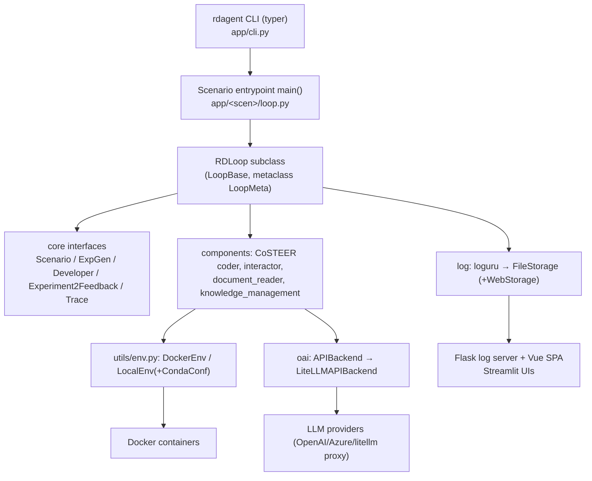

# Agent Onboarding: RD-Agent

Document scope: repository familiarization report for AI agents taking over this
repository, followed by the owner's binding working agreement.

| Field | Value |
| --- | --- |
| Repository | `rdagent` — "Research & Development Agent" (MSRA-MIIC / Microsoft Research) |
| Reported revision | `484776c` (`chore(main): release 1.0.0`) |
| Working tree at time of survey | clean except untracked `.idea/` |
| Upstream parity | `HEAD` byte-identical to `microsoft/RD-Agent` `main` (verified against the GitHub commits API) |
| Survey method | read-only source inspection; no files modified during the survey |

> This document contains no credentials, keys, or personal data. Environment
> variable *names* appear only as configuration interface documentation.

---

# Repository Familiarization Report

## 1. Executive Summary

**Project**: `rdagent` — "Research & Development Agent" (MSRA-MIIC / Microsoft Research). An autonomous LLM-agent framework that iterates *propose → implement → execute → feedback* to automate R&D in data-driven domains (quant/factor/model discovery, Kaggle/MLE-bench data science, LLM fine-tuning, agentic RL post-training).

**Application type**: research project + **CLI-driven multi-scenario agent framework**. Not a library, not a service. It additionally ships two GUI layers (Streamlit viewers, Flask log server + Vue SPA).

**Scale**: 534 Python files, ~65,500 LOC under `rdagent/`; 694 tracked files in the package tree; 1023 commits.

**Verified state (facts, not assumptions)**
- Working tree is **pristine upstream**: local `HEAD = 484776c` (`chore(main): release 1.0.0`), byte-identical to `microsoft/RD-Agent` `main` HEAD (confirmed via GitHub API commit list). `git status` shows only untracked `.idea/`. Remote is a mirror fork (`Ghostfusion/RD-Agent`), no local modifications.
- No git tags exist in this clone, though `CHANGELOG.md`, `Makefile changelog`, and `release.yml` assume tags.
- `rdagent/` has **no `__init__.py`** (PEP 420 namespace package); `pyproject.toml` declares `packages = ["rdagent"]` — identical to upstream, so this is upstream behaviour, not fork drift. `find_packages()` → 0, `find_namespace_packages()` → 249.
- Local env: Python **3.12.10** (project declares 3.10/3.11), `rdagent` **not installed**, core deps missing (`loguru`, `dill` absent → pytest collection fails). Docker 29.8.0 available.

## 2. Repository Structure

```text
rdagent/
├─ core/            # Abstract domain: Scenario, Task, Experiment, Workspace, Trace, Hypothesis,
│                   # Feedback, Evaluator, CoSTEER's evolving framework, conf, signed pickle, exceptions
├─ oai/             # LLM abstraction: backend/{base,litellm,deprec,pydantic_ai}, llm_utils, llm_conf, utils/
├─ utils/           # env.py (Local/Conda/Docker execution), workflow/{loop,tracking,misc}, agent/ (pydantic-ai),
│                   # repo/, blob/, archive.py, artifact_transport.py, fmt.py, qlib.py
├─ components/      # Reusable scenario-agnostic pieces:
│   ├─ coder/CoSTEER/   # generic RAG evolutionary coder
│   ├─ coder/{data_science,factor_coder,model_coder,finetune,rl}/  # scenario coders
│   ├─ runner/          # only CachedRunner
│   ├─ proposal/, interactor/, loader/, benchmark/, agent/{mcp,rag,context7}, knowledge_management/
│   └─ workflow/rd_loop.py   # RDLoop = LoopBase + scenario components
├─ scenarios/       # Scenario-specific: data_science/, kaggle/, finetune/, rl/, general_model/, qlib/, shared/
├─ app/             # Entrypoints + settings per scenario: cli.py, data_science/, qlib_rd_loop/, kaggle/,
│                   # finetune/, rl/, benchmark/, general_model/, CI/, utils/
└─ log/             # logger (loguru), storage (file), server/ (Flask), ui/ (Streamlit), timer, mle_summary
web/                # Vue 3 + Vite SPA frontend for the Flask log server
test/               # pytest suite (161 test functions)
docs/               # Sphinx (furo) → readthedocs
```

## 3. Architecture



Two distinct engine styles coexist:
1. **`LoopBase`** (`utils/workflow/loop.py`, 568 lines) — the production engine: `LoopMeta` metaclass auto-collects step names from methods; an asyncio scheduler (1 `kickoff_loop` + `N` `execute_loop` workers) runs loops concurrently with per-step semaphores; every completed step is snapshotted to `log/<ts>/__session__/<loop>/<idx>_<step>` via HMAC-signed pickle.
2. **`utils/agent/`** (pydantic-ai, Prefect-cached `@tool` agents) — newer agent infra used by `components/agent/{mcp,rag,context7}` and AutoRL-Bench.

## 4. Core Components

| Component | File | Role |
|---|---|---|
| `Scenario` (ABC) | `core/scenario.py` | Background/description/runtime-env provider |
| `AbsTask`/`Task`/`UserInstructions` | `core/experiment.py` | Unit of work + priority user directives |
| `Workspace`/`FBWorkspace` | `core/experiment.py:105-395` | File-based code workspace: `inject_files` (path-escape guard), `run(env, entry)`, zip checkpoints |
| `Experiment`/`ExperimentPlan` | `core/experiment.py:400-500` | sub_tasks + sub_workspace_list + experiment_workspace + `running_info` |
| `Hypothesis`, `ExperimentFeedback`, `HypothesisFeedback` | `core/proposal.py` | Research idea + LLM judgement (`decision`, `acceptable`, `exception`) |
| `Trace` | `core/proposal.py:~130-320` | Multi-branch DAG of `(Experiment, Feedback)`; `current_selection`, `dag_parent`, `idx2loop_id` |
| `ExpGen`/`HypothesisGen`/`Hypothesis2Experiment`/`Experiment2Feedback` | `core/proposal.py` | The "R" half + feedback policy; `ExpGen.async_gen` throttles to `get_max_parallel()` |
| `Developer` | `core/developer.py` | The "D" half — **mutates `exp` in place**, returns it |
| `Evaluator`/`IterEvaluator`/`Feedback`/`EvoStep`/`EvolvingStrategy`/`RAGStrategy`/`EvoAgent`/`RAGEvoAgent` | `core/evaluation.py`, `core/evolving_framework.py`, `core/evolving_agent.py` | Generic evolutionary loop used by every CoSTEER coder |
| `CoSTEER(Developer)` | `components/coder/CoSTEER/__init__.py` | RAG-driven evolve loop with fallback selection, max-time/global-timer stop, `CoderError` on total failure |
| `APIBackend` | `oai/backend/base.py` | Abstract LLM backend: retry, SQLite prompt cache, auto-continue, `ChatSession` |
| `Env`/`EnvResult` | `utils/env.py` | Execution abstraction: `LocalEnv`, `CondaEnv`, `DockerEnv` + scenario confs |
| `RDAgentLog` | `log/logger.py` | Singleton fan-out logger with `tag()` context, `log_object()`, PID-chain tags |

## 5. Execution Flow

Entry (`rdagent/app/cli.py`) loads `.env` **before** settings init, then dispatches. Canonical DS path:

```text
rdagent data_science --competition <name>
  → app/data_science/loop.py: main()
    → DS_RD_SETTING.competition = competition
    → DataScienceRDLoop(DS_RD_SETTING)          # scenarios/data_science/loop.py:87
    → asyncio.run(loop.run(step_n, loop_n, timeout))
      → LoopBase.run → kickoff_loop + N×execute_loop
        → step 0 direct_exp_gen(prev_out)        # async; ckpt_selector → exp_gen.async_gen → interactor
        → step 1 coding                          # per-task CoSTEER coder (DataLoader/Feature/Model/Ensemble/Workflow/Pipeline)
        → step 2 running                         # DSCoSTEERRunner.develop → CoSTEER → DSRunnerEvaluator → Env.run
        → step 3 feedback                        # DSExperiment2Feedback → LLM judgement JSON
        → step 4 record                          # trace.sync_dag_parent_and_hist, SOTA selection, log archive
```

- **Config**: pydantic-settings singletons, env-driven; `ExtendedBaseSettings.settings_customise_sources` chains *parent-class* env sources so subclass prefixes (`DS_`) also read base (`KG_`) vars.
- **DI**: by string import — `import_class(PROP_SETTING.<slot>)`. Every scenario component (scen, hypothesis_gen, summarizer, selector_name, sota_exp_selector_name, interactor) is swappable by config.
- **Error handling**: `LoopBase._run_step` classifies exceptions via `skip_loop_error` (DS: `CoderError`, `RunnerError` → jump to `record`), `withdraw_loop_error` (DS: `PolicyError` → roll back to previous loop and restart all coroutines via `LoopResumeError`), otherwise re-raise.
- **Shutdown**: `LoopTerminationError` (step/loop count, timer) → `kill_subprocesses()` terminates the process tree with psutil.

## 6. Data Flow

```text
Competition name/URL → DataScienceScen (LLM-written description, timeouts, metric direction)
  → ExpGen (identify_problem → hypothesis_gen → critique → rewrite → select → task_gen)
  → DSExperiment.pending_tasks_list (list[list[Task]])
  → CoSTEER evolution: LLM writes code per task into FBWorkspace.file_dict
  → Env.run (docker/conda): mount workspace, timeout, chmod 777, stdout/exit_code/running_time
  → scores.csv → exp.result (pandas DataFrame, "ensemble" row)
  → LLM feedback (decision/acceptable/reason/code_change_summary)
  → Trace (DAG) → sota_exp_to_submit
  → log files: {pkl,json}.log per tag/PID + __session__ pickles
```

**Serialization**: everything persisted goes through `core/serialization.py` — `MAGIC + HMAC-SHA256 + pickle`; unsigned legacy pickles are **rejected** unless `ALLOW_UNSAFE_LEGACY_PICKLE`. Zip archives are extracted only via `utils/archive.py:safe_extract_zip/tar` (traversal, symlink, member/size caps).

## 7. External Dependencies

| Dependency | Why | Integration | Configured by | Failure mode |
|---|---|---|---|---|
| LLM provider (OpenAI/Azure/OpenRouter/litellm) | all reasoning/codegen | `oai/backend/litellm.py` (`LiteLLMAPIBackend` default) | `LLM_SETTINGS` (env, no prefix): `CHAT_MODEL`, `OPENAI_API_KEY`, `OPENROUTER_API_KEY`, `BACKEND` | retry `max_retry=10`, then `APIBackend` raises; timer counts API fails |
| Embeddings (`EMBEDDING_MODEL`) | RAG/knowledge base, similarity ranking | same LiteLLM backend (`create_embedding`); required by CoSTEER V2 knowledge query | `LLM_SETTINGS.embedding_model` + the matching provider key | 10 retries then `RuntimeError`; **never** falls back silently |
| Docker daemon | sandboxed code execution | `utils/env.py:DockerEnv` (docker SDK) | `DockerConf`, `DS_RD_SETTING.env_type` | `retry_count=5` then raise; `health_check -d` |
| Conda | local env fallback | `LocalEnv` + `CondaConf` | `env_type="conda"` | name/version regex validation; `_prepare_conda_env` |
| Kaggle API | competition data/submission | `scenarios/kaggle/kaggle_crawler.py`, `KaggleError` | `KG_AUTO_SUBMIT`, `local_data_path` | `KaggleError`; slug validated by `scenarios/kaggle/security.py` |
| HuggingFace datasets | fine-tune data | `scenarios/finetune/download/hf.py`, `datasets` | FT settings | download error surfaces |
| MLflow / AzureML | optional metric tracking | `utils/workflow/tracking.py` | `RD_AGENT_SETTINGS.enable_mlflow` (default False) | no-op when disabled/import fails |
| Prefect | agent tool caching | `components/agent/base.py` | implicit | cache miss → normal call |
| MCP servers (context7) | doc lookup | `components/agent/context7` | `CONTEXT7_*`, `MCP_ENABLED` | disabled by default |

## 8. Configuration

`ExtendedBaseSettings` (pydantic-settings) + `dotenv`. Secrets are read from env only; none are committed (`.env` is gitignored; `.env.example` holds placeholders).

| Configuration | Purpose | Default | Required? | Used By |
|---|---|---|---|---|
| `BACKEND` | LLM backend class | `rdagent.oai.backend.LiteLLMAPIBackend` | No | `oai/llm_utils.get_api_backend` |
| `CHAT_MODEL`,`EMBEDDING_MODEL` | model names | `gpt-4-turbo`, `text-embedding-3-small` | Yes for real runs | `LLM_SETTINGS` |
| `OPENAI_API_KEY`/`OPENAI_API_BASE` (or `CHAT_*`/`EMBEDDING_*`) | credentials/endpoint | `""` | Yes (or Azure variants) | LiteLLM backend |
| `OPENROUTER_API_KEY` with `openrouter/…` model ids | one credential covers chat **and** embeddings | unset | No | LiteLLM backend; `health_check.env_check` |
| `EMBEDDING_MODEL` | embedding model (must match the key's provider) | `text-embedding-3-small` (needs `OPENAI_API_KEY`) | Yes when RAG runs | `APIBackend.create_embedding` |
| `MAX_RETRY`,`RETRY_WAIT_SECONDS` | LLM retry policy | 10, 1 | No | `APIBackend._try_create_chat_completion_or_embedding` |
| `USE_CHAT_CACHE`/`USE_EMBEDDING_CACHE` | prompt cache | False | No | `SQliteLazyCache` (`prompt_cache.db`) |
| `DS_COMPETITION` | DS task | `""` (MLE default in main) | Yes for DS | `DataScienceRDLoop` |
| `DS_CODER_ON_WHOLE_PIPELINE` | whole-pipeline vs staged coding | True | No | DS loop/exp_gen |
| `DS_ENABLE_KNOWLEDGE_BASE`,`DS_SELECTOR_NAME`,… | DS policy surface | see `app/data_science/conf.py` | No | DS loop |
| `KG_COMPETITION`,`KG_AUTO_SUBMIT` | Kaggle scenario | `""`, False | No | `KaggleRDLoop` |
| `FT_*`, `RL_*`, `BENCHMARK_*`, `CoSTEER_*`, `DS_Coder_CoSTEER_` | per-scenario/per-coder knobs | see conf files | No | resp. components |
| `MULTI_PROC_N`,`STEP_SEMAPHORE` | parallelism | 1 | No | `LoopBase` |
| `WORKSPACE_PATH` | workspace root | `./git_ignore_folder/RD-Agent_workspace` | No | `FBWorkspace` |
| `ARTIFACT_SIGNING_KEY`/`ARTIFACT_SIGNING_KEY_PATH` | pickle HMAC key | derived, `~/.rdagent/artifact_signing.key` | No (auto-generated, 0600) | `core/serialization.py` |
| `ALLOW_UNSAFE_LEGACY_PICKLE` | accept old unsigned pickles | False | No | serialization, UI |
| `LOG_TRACE_PATH` | log root | `./log/<UTC ts>` | No | log/logger |
| `UI_SERVER_AUTH_TOKEN`,`UI_CORS_ALLOWED_ORIGINS` | server auth | `""`, `[]` | **Yes for `server_ui`** (else 503) | Flask log server |
| `ENABLE_MLFLOW` | tracking | False | No | `WorkflowTracker` |

Note: `pyproject` sets `coverage fail_under=80`, but `Makefile test` passes `--fail-under 20` (deliberate drop, commented `# 80`).

## 9. Error Handling & Reliability

- **Exception taxonomy** (`core/exception.py`): `WorkflowError` → `FormatError` (→ `CodeBlockParseError`), `CoderError` (→ `CodeFormatError`, `CustomRuntimeError`, `NoOutputError`, alias `FactorEmptyError`/`ModelEmptyError`), `RunnerError`, `KaggleError`, `PolicyError`, `EvaluatorDidNotTerminateError`. `CoderError.caused_by_timeout` drives DS timeout-escalation.
- **Retries**: LLM `max_retry=10` with failure classification (policy violation `violation_fail_limit`, timeout `timeout_fail_limit`); `Env.__run_with_retry` (`retry_count=5`); `wait_retry()` decorator on `backup_folder`, `implement_one_task`.
- **Recovery**: session snapshots per step allow `load(path, checkout=…)`, `withdraw_loop`, `truncate_session_folder`, `logger.truncate_storages`. `truncate_session_folder` assumes session dirs are named by integer loop index.
- **Concurrency safety**: `record`/`feedback` semaphores forced to 1 (documented race rationale at `utils/workflow/loop.py:149-156`); file locks around pickle cache and the signing key.
- **Known fragility**: `record` walks `prev_out["running"] | "coding" | direct_exp_gen.exp_gen` depending on exception type; DS restart logic keys off `DS_RD_SETTING.consecutive_errors` / `coding_fail_reanalyze_threshold`.

## 10. Concurrency & Performance

- **asyncio engine**: `kickoff_loop` + `get_max_parallel()` `execute_loop` workers; synchronous steps optionally pushed to `ProcessPoolExecutor` when `is_force_subproc()` (i.e. `subproc_step` or parallelism > 1) with `copy.deepcopy` of step state (explicit note about mutated-dict errors).
- **Multiprocessing**: `core/utils.multiprocessing_wrapper` for per-task LLM/coder fan-out, coordinating `LLM_CACHE_SEED_GEN` so cache traces stay reproducible.
- **Per-step semaphores**: `RD_AGENT_SETTINGS.step_semaphore` (int or `{"coding":3,...}`).
- **Caching**: `cache_with_pickle` (per-function dir, md5 key, file lock), `Env.cached_run` (key = md5 of workspace file contents + entry + volumes; stores `EnvResult` + zip diff), SQLite prompt cache, Streamlit `st.cache_data`.
- **Batching/pools**: none for DB. Docker resource limits via `DockerEnv._gpu_kwargs` / container limits. `pandarallel` in deps (generated code), `psutil` for process-tree kill.

## 11. Testing

- Framework: **pytest** (`pyproject`: `-l -s --durations=0`, `log_cli`, marker `offline`, `norecursedirs=workspace`). 161 test functions across 27 files.
- **Offline** (`-m offline`, what CI runs): `test/core/test_serialization.py` (9), `test/log/server/test_security.py` (22), `test/utils/test_archive_security.py` (8), `test_artifact_transport.py`, `test_conda_security.py`, `test_import.py`, `test_misc.py`, `test/scenarios/data_science/test_debug_data.py`, `test_secure_parsing.py`, `test/rl/test_ui_data_loader.py`.
- **Network-dependent**: all of `test/oai/*` (completions, embeddings, advanced cache, pydantic-ai, prefect cache, connectivity to `localhost:4000`) and `test/utils/test_agent_infra.py`, `test/qlib/*`, `test/finetune/*`.
- Strong coverage: security boundaries (archive traversal, signed pickle, conda name validation, server auth/origin), notebook conversion utils (56 tests), serialization.
- Lightly covered: the loop engine (`LoopBase`/`RDLoop`), DS proposal/trace/scheduler logic, CoSTEER internals (only 5 tests), `utils/env.py` (8), runners. Coverage was **not** measured.
- Local verification attempt: `pytest -m offline` **fails at collection** here (`ModuleNotFoundError: loguru`, `dill`) — the environment has no installed deps; `pip install -e .[test] -c constraints/3.11.txt` is required before any test run.

## 12. Build & Development Workflow

| Task | Command (from Makefile / CI) |
|---|---|
| Install (runtime) | `pip install -e . -c constraints/<py>.txt` (`make install`) |
| Dev install | `make dev` → `pip install -e .[docs,lint,package,test] -c constraints/$(PYTHON_VERSION).txt` + pre-commit hook |
| Run app | `rdagent data_science --competition X` / `rdagent fin_quant` / `rdagent llm_finetune …`; also `python rdagent/app/<x>/loop.py` |
| UI | `rdagent ui --port 19899 --log-dir log/ [--data-science]`; `rdagent server_ui --port 19899 [--host 0.0.0.0]`; `rdagent ds_user_interact` |
| Tests | `make test-offline` (CI) / `make test` (all); raw: `pytest -m offline` |
| Lint | `make lint` = `mypy` + `ruff` + `isort` + `black` + `toml-sort` (**mypy/ruff only scan `rdagent/core`**) |
| Format | `make auto-lint` (auto-isort, auto-black, auto-toml-sort) |
| Docs | `make docs-gen` (sphinx, `-W`), `make docs` (changelog + mypy/coverage reports) |
| Packaging | `make build` (`python -m build`), `make upload` (twine) |
| Web | `cd web && npm install && npm run build:flask` (outputs `git_ignore_folder/static`) |
| DB migrations | **none** (no database) |
| Docker images | `rdagent/scenarios/kaggle/docker/{DS_docker,kaggle_docker,mle_bench_docker}/Dockerfile` |

CI (`.github/workflows/ci.yml`): matrix Python 3.10/3.11, `make dev` then `make lint docs-gen test-offline`, actions pinned to full SHAs. `pr.yml` = commitlint (commitlintrc.js). `release.yml` = release automation; `readthedocs-preview.yml` = docs preview.

## 13. Git / Recent Changes

- 1023 commits, 2024-04-03 → HEAD. Recent work is dominated by **security hardening and CI/release hygiene**: `#1471` verify persisted artifacts before deserialization, `#1469` harden execution and archive handling, `#1468` harden log server web boundaries, `#1497` require auth + trusted origins for server UI APIs (BREAKING: `UI_SERVER_AUTH_TOKEN` required; URL/server-path report uploads removed), `#1495`/`#1496` NameError regressions from the hardening refactor (`pickle`, `re` imports), `#1345`/`#1386` web UI server + trace sync.
- Feature history: `#1348` AutoRL-Bench, `#1368` DeepSearchQA, `#1406` FT-Agent ICML release.
- `TODO/FIXME/HACK/XXX`: 147 markers; densest in `oai/backend/deprec.py` (9), `data_science/proposal/exp_gen/proposal.py` (7), `CoSTEER/evaluators.py` (7), `utils/env.py` (5), `core/experiment.py` (5). `TODO.md` records two global naming mismatches (`components/coder` vs `scenarios/developer`; "scenarios in experiments").

## 14. Documentation vs Implementation

| Finding | Classification |
|---|---|
| README install (`pip install rdagent`), CLI list (`fin_factor`, `fin_model`, `fin_quant`, `fin_factor_report`, `general_model`, `data_science`, `llm_finetune`, `ui`, `server_ui`, `health_check`) | **Accurate** — all exist in `app/cli.py` |
| `rdagent kaggle --competition …` ("This command is recommended") in `app/data_science/loop.py:59` and `app/kaggle/loop.py:120` | **Outdated/wrong** — no `kaggle` command is registered; must use `rdagent data_science` |
| README "web UI … currently excluding the `data_science` scenario"; asks users to use `rdagent ui --data-science` | **Accurate** — matches `cli.ui(data_science=…)` and `web/README.md` |
| README MLE-bench/quant results, arXiv IDs, ICML/ACL acceptance | **Unverifiable from code** — claims only; note arXiv IDs are future-dated |
| `LoopBase` docstring "Postscripts: originally planned with generators; generators are not picklable" | **Accurate** — explains snapshot design |
| `components/runner/` described loosely as "runner abstraction" | **Implementation differs** — package contains only `CachedRunner`; runners are scenario `Developer` subclasses that call `FBWorkspace.execute(env, entry)` |
| `core/scenario.py` TODO claims `source_data` should be replaced by `get_source_data_desc` | **Outdated TODO** — replacement already done (`source_data` delegates) |
| `Makefile test` uses `--fail-under 20` while `pyproject` says 80 | **Unclear/stale** (deliberate downgrade with `# 80` comment) |
| Docs (`docs/scens/*`) describe per-scenario behaviour | Not exhaustively cross-checked → **requires further investigation** |

## 15. Important Contracts & Invariants

**Explicit (enforced by code/tests)**
- The **last step must record** (`LoopBase` docstring); `record` is serialized (semaphore = 1).
- `Developer.develop` **must mutate `exp` in place** and preserve intermediates on error (`core/developer.py`).
- Persisted objects must be **HMAC-signed**; unsigned pickles raise `UntrustedArtifactError` unless explicitly opted in (`core/serialization.py`, `test/core/test_serialization.py`).
- Archive extraction must reject traversal/symlink/oversize (`utils/archive.py`, `test/utils/test_archive_security.py`).
- Workspace file writes must stay inside `workspace_path` (`FBWorkspace._resolve_workspace_path`).
- Competition slugs must match a strict pattern (`scenarios/kaggle/security.py`).
- `LoopBase.steps` is derived by metaclass; **overriding a step name in a subclass does not create a new step** (documented deliberately).
- `step_idx[li]` advance ordering: snapshot is dumped **after** the index update, so restore lands on the right step.
- Prevent skip backwards when `skip_loop_error_stepname` precedes current step (raises `RuntimeError`).
- `enable_cross_trace_diversity` and `llm_select_hypothesis` are mutually exclusive (module-level `assert` in `app/data_science/conf.py`).
- `ExpGen.async_gen` must not exceed `RD_AGENT_SETTINGS.get_max_parallel()` unfinished loops.
- `SingletonBaseClass` instances are deliberately unpicklable (`__reduce__` raises).

**Implicit**
- `Experiment.result` is meaningful only after runner sets `running_info.result`; `DSExperiment.is_ready_to_run()` gates on `main.py` presence.
- DS `COMPLETE_ORDER = ("DataLoadSpec","FeatureEng","Model","Ensemble","Workflow")` defines staged completion.
- Trace DAG `dag_parent` tuples: `()` = new root, `(-1,)` = latest node, `(idx,)` = explicit parent; multiple parents not implemented.
- Log tag names (`Loop_<li>.<step>`, `scenario`, `SOTA experiment`, `trace`) are consumed by UI/MLE summary.

**Assumption (needs confirmation)**
- `packages=["rdagent"]` + namespace package yields a working wheel including subpackages (upstream-identical, not verified by a local install).
- Windows support: `link_all_files_in_folder_to_workspace` uses `os.link`; several paths call `cp`/`tar`/`timeout` shell binaries (Linux-oriented; README badge says Linux-only).
- `artifact_signing_key` auto-generation at a shared path converts pre-existing unsigned caches into misses.

## 16. Engineering Conventions

- **Naming**: `ASpecific*` TypeVars; `*Conf`/`*Settings` (pydantic) vs `*_SETTING(S)` singletons; ABCs in `core/*`; concrete components named by scenario prefix (`DS*`, `KG*`, `FT*`).
- **Config**: subclass `ExtendedBaseSettings`, declare `SettingsConfigDict(env_prefix=…)`, export a module-level singleton; components wired by dotted-path strings resolved with `import_class`.
- **Typing**: full annotations, `from __future__ import annotations`, `TYPE_CHECKING` guards; mypy strict flags but only `rdagent/core` enforced.
- **Async/sync**: steps may be sync or `async def` — `LoopBase` sniffs `iscoroutinefunction`; long fan-out uses `multiprocessing_wrapper`.
- **Logging**: always `from rdagent.log import rdagent_logger as logger`; structured objects via `logger.log_object(obj, tag=…)`; `logger.tag("Loop_x.step")` scoping.
- **Errors**: raise from the `core/exception.py` taxonomy so the loop can classify (skip/withdraw).
- **Formatting/lint**: black 120 cols, isort (black profile), ruff `select=ALL` with a long ignore list, toml-sort; pre-commit on push.
- **⚠️ `pyproject.toml` sets `[tool.ruff] fix = true`**, so a bare `ruff check <file>` **rewrites the file in place**, including unrelated lines (it dropped an unused `import litellm` and de-quoted six `f""` literals in `app/utils/health_check.py`). Use `ruff check --no-fix` for inspection, and `git diff` after any `ruff check` to confirm the change surface.
- **CI lints only `rdagent/core`** (`Makefile` `mypy`/`ruff` targets are scoped to it), so other packages carry pre-existing lint debt — e.g. `app/utils/health_check.py` has 41 ruff findings. Do not treat that debt as in-scope work.
- **Tests**: pytest with `@pytest.mark.offline` for anything not touching LLMs/network/docker; `tmp_path` fixtures; security tests raise `ValueError(..., match=...)`.
- **Prompts/templates**: `utils/agent/tpl.py` `T(".prompts:key.subkey").r(...)` reading YAML under the caller's package; scenario prompt packs (`share.yaml`, `prompts.yaml`, `prompts_v2.yaml`).
- **Comments**: English with sporadic Chinese (e.g. `scenarios/data_science/dev/feedback.py`, `app/rl/loop.py`); `TODO(xxx)` attribution style.

## 17. Critical Files

**Tier 1 — must understand**
1. `rdagent/utils/workflow/loop.py` — the engine: scheduling, snapshots, semaphores, skip/withdraw/terminate semantics, `load`/`dump`. Any loop-behaviour change starts here.
2. `rdagent/core/experiment.py` — `Task`/`Workspace`/`FBWorkspace`/`Experiment`: the data contract flowing through every step; contains the workspace escape guard.
3. `rdagent/core/proposal.py` — `Trace` DAG + all R&D interfaces (`ExpGen`, `HypothesisGen`, `Hypothesis2Experiment`, `Experiment2Feedback`); defines the selection/parenting invariants.
4. `rdagent/components/workflow/rd_loop.py` — `RDLoop`: how scenario components are instantiated and how steps marshal `prev_out`.
5. `rdagent/app/cli.py` — the only `rdagent` console entry; `.env` bootstrap ordering.
6. `rdagent/oai/backend/base.py` + `rdagent/oai/llm_utils.py` — LLM retry/cache/session contract and dynamic backend selection.
7. `rdagent/utils/env.py` — execution sandbox contract (`Env`, `EnvResult`, Docker/Conda confs, caching).
8. `rdagent/core/conf.py` + `rdagent/oai/llm_conf.py` — settings model and the parent-env chaining trick.
9. `rdagent/scenarios/data_science/loop.py` — the flagship scenario's step implementations and failure/restart policy.
10. `rdagent/core/serialization.py` — signed-pickle boundary that every persisted artifact crosses.

**Tier 2 — important**: `components/coder/CoSTEER/{__init__,evolving_strategy,evaluators,knowledge_management}.py`; `core/evolving_agent.py`; `core/evolving_framework.py`; `scenarios/data_science/proposal/exp_gen/{proposal,base,router,trace_scheduler}.py`; `scenarios/data_science/dev/{feedback.py,runner/}`; `log/{logger,storage,conf,timer}.py`; `log/server/{app,security}.py`; `utils/archive.py`, `utils/artifact_transport.py`, `core/utils.py`; `components/agent/*`.

**Tier 3 — supporting**: `app/*/conf.py`; `log/ui/*`; `utils/{fmt,repo,qlib,blob}`; `scenarios/kaggle/*`; `web/`; `scripts`, `docs`, `Makefile`, workflows.

## 18. Risk Areas

- **Global mutable state**: `Trace.current_selection` is a *global* selection while multi-trace runs use per-experiment `local_selection`; the DS loop re-synchronises them in `feedback`/`record`. Easy to break under parallelism.
- **`prev_out` dict contract**: steps read keys produced by other steps (`prev_out["coding"]`, `prev_out["running"]`, `EXCEPTION_KEY`), with fallback chains in `record`. Renaming a step or key silently changes routing.
- **Metaclass step collection**: adding/renaming a public method on a loop subclass adds a *step*; underscore-prefix or `load`/`dump` are excluded. Subtle.
- **Pickle-everything persistence**: loop state, knowledge bases, caches, and env results are pickled; a class rename breaks session restore, and the signing-key path is a cross-machine compatibility boundary.
- **Signed-pickle migration**: all pre-`#1471` logs/caches are unsigned → rejected (they were the source of the `#1496` NameError bugs). Legacy path only via `ALLOW_UNSAFE_LEGACY_PICKLE`.
- **Snapshot/withdraw logic**: `withdraw_loop` reads `session_folder/<loop-1>` and sorts filenames by leading int; `truncate_session_folder` assumes integer dir names.
- **DS restart thresholds** (`consecutive_errors`, `coding_fail_reanalyze_threshold`) and timeout escalation mutate `trace.scen` in place.
- **Shell/OS coupling**: generated commands use `timeout`, `cp -r -P`, `tar`, `chmod 777`, `find`; Windows is effectively unsupported. POSIX-only assumption in `link_all_files_in_folder_to_workspace`.
- **External API assumptions**: LLM JSON-mode outputs are parsed by fuzzy heuristics (`JSONParser`, `convert2bool`, `dict_get_with_warning`) with silent defaults.
- **Duplicate/legacy paths**: `DeprecBackend` duplicates Azure/OpenAI logic; `inject_code_from_file_dict` is deprecated-but-present; `debug_app.py` is an unauthenticated legacy server.
- **Test coverage asymmetry**: security and notebook utils are well pinned; the loop engine and DS reasoning paths are not, so behavioural regressions there will not be caught by CI.

## 19. Open Questions / Unknowns

1. **Does the declared packaging actually produce a working wheel?** Evidence: no `rdagent/__init__.py`; `find_packages()`=0; `packages=["rdagent"]`; upstream-identical. Matters because `rdagent` CLI imports subpackages. Resolve by `python -m build` + install into a venv and `rdagent --help`.
2. **Is the environment expected to run Python 3.12?** Local interpreter is 3.12.10, project declares 3.10/3.11 and CI tests only those. `constraints/3.12.txt` is absent. Resolve by attempting `make dev` or reading CI failures.
3. **Trajectory of the security hardening** (`#1469/#1471/#1497`): are there remaining unhardened deserialization sites? Raw `pickle`/`dill` import appears only through the secure wrapper in `core/knowledge_base.py`; not exhaustively audited. Resolve with a full audit of `*.load(`/`pickle` call sites.
4. **Which loop classes are actually maintained?** `KaggleRDLoop` exists but is unreachable via CLI (only `data_science` is registered). Unknown whether the Kaggle path is legacy.
5. **`web/` build integration**: `npm run build:flask` writes to `git_ignore_folder/static`; `UI_SETTING.static_path` defaults to the same. Whether `server_ui` serves prebuilt assets out of the box (vs. requiring a build) is unverified.
6. **MLE-bench evaluation wiring** (`if_using_mle_data`, `eval_sub_dir`, `mle_summary.grade_summary`) — present but not exercised here; the exact data-layout contract is undocumented in code.
7. **AutoRL-Bench** (`scenarios/rl/autorl_bench`) is a self-contained benchmark package with its own README/conf and offline tests; its integration depth with the main `LoopBase` engine is unverified.
8. **`docs/` accuracy for each `scens/*.rst`** — not cross-checked line by line.

## 20. Mental Model for Future Work

> "If I am asked to change X, where do I look first, what depends on it, what contracts must I preserve, and what tests should I run?"

**Routing table**

| Ask | Look first | Depends on it | Contracts to preserve | Verify with |
|---|---|---|---|---|
| Change loop scheduling / resumption / parallelism | `utils/workflow/loop.py` | every `RDLoop` subclass, `log/{logger,timer}` | last-step-record; step_idx/snapshot ordering; `record`/`feedback` serialized; signed pickle format | `make test-offline`; smoke: run a 1-step DS loop and `LoopBase.load(path)` |
| Change a scenario's R&D policy (selection, proposal, feedback) | `scenarios/<scen>/proposal/**`, `app/<scen>/conf.py` | `Trace`, `ExpGen`, selectors, summarizer | `Trace` DAG parent syntax; `local_selection` ↔ `current_selection` sync; component names are config strings | offline tests + run loop with `--step-n 1` |
| Change code generation / evolution | `components/coder/CoSTEER/**`, `core/evolving_{framework,agent}.py` | all scenario coders + `DSCoSTEERRunner` | `Developer.develop` in-place mutation; `CoSTEERMultiFeedback` shape; `CoderError`/`caused_by_timeout` | `test/utils/coder/test_CoSTEER.py`; run coder on a fixture task |
| Change execution/env behaviour | `utils/env.py`, `components/coder/data_science/conf.py:get_ds_env` | `FBWorkspace.run`, runners, evaluators | `EnvResult(stdout/exit_code/running_time)`; cache key inputs; workspace mount semantics; `safe_extract_zip` | `test/utils/test_env.py`, `test/utils/test_conda_security.py`, smoke docker run |
| Change LLM calls/backends | `oai/backend/{base,litellm}.py`, `oai/llm_conf.py` | nearly everything | cache key derivation; `ChatSession` conversation ids; retry/auto-continue semantics; JSON-mode contract | `test/oai/*` (network) + offline `test/oai/test_base.py` |
| Change persistence/logging | `log/{logger,storage,conf}.py`, `core/serialization.py` | UI, MLE summary, session restore | tag naming; signed-pickle format & key path; `log_object` payload picklability | `test/core/test_serialization.py`, `test/log/server/test_security.py` |
| Change the web surface | `log/server/{app,security}.py`, `log/ui/*`, `web/` | `rdagent server_ui`, `ds_user_interact` | auth token required; exact-origin CORS; upload validation; trace-id pointer protocol | `test/log/server/test_security.py`; browse the UI |
| Add a new scenario/app | copy `app/qlib_rd_loop/` + `scenarios/<x>/`, register in `app/cli.py` | `components/workflow/rd_loop.RDLoop` | `BasePropSetting` slots; step names produce `prev_out` keys | unit-run the new loop end to end |

**Orientation defaults**
- Read `core/` first to know the interfaces, then the scenario's `loop.py` to see which implementations are wired, then `app/<scen>/conf.py` to see what is configurable.
- **Two extension points dominate the codebase**: (a) *config-string component swapping* (`import_class(PROP_SETTING.x)`), and (b) *new `LoopBase` step methods*. Prefer (a) unless you need a new phase.
- **Persisted artifacts are a public contract**: changing a pickled class's import path or fields breaks session resume and legacy caches; changing the signing key invalidates all caches.
- **Always check the loop's failure taxonomy** before changing a step: exceptions are routed, not just propagated (`skip_loop_error` → jump to `record`; `withdraw_loop_error` → rollback + restart).
- **Verification reality check**: this checkout has no dependencies installed and no `rdagent` package installed; `pytest -m offline` currently fails at import. Any future task must first install (`make dev` or `pip install -e .[test]`), and note the local interpreter (3.12) is outside the CI matrix (3.10/3.11).

## 21. Sister Repository: `microsoft/qlib`

`microsoft/qlib` (`pyqlib`) is the sister repository: the quant research platform
that the `fin_factor` / `fin_model` / `fin_quant` / `fin_factor_report` scenarios
drive. Local clone: `D:/Users/vince/PycharmProjects/qlib` (remote mirror
`Ghostfusion/qlib`, HEAD `be725493`, 232 modules / 56,216 LOC, no tags).

### The integration is deliberately out-of-process — do not vendor qlib code

| Fact | Evidence |
| --- | --- |
| `pyqlib` is in **no** dependency file | absent from `requirements.txt`, `requirements/*.txt`, `constraints/*.txt`, `pyproject.toml` |
| qlib is provisioned as a *runtime artifact*, not an import | `Makefile:65-67` (conda env `qlibRDAgent`, Python 3.8); `scenarios/qlib/docker/Dockerfile:13,17` (image `local_qlib:latest`); `utils/env.py:871` (pinned conda install) |
| qlib is imported **only inside templates that execute inside the qlib env** | `scenarios/qlib/experiment/{factor_template,model_template}/read_exp_res.py` (`qlib.init()`, `from qlib.workflow import R`), `factor_data_template/generate.py` (`from qlib.data import D`), lazy import at `utils/qlib.py:190-191` |
| `utils/qlib.py` holds only qlib **DSL expression strings** (`ALPHA20`, `ALPHA158`) and `validate_qlib_features()` — no qlib import at module scope | `utils/qlib.py:1-30` |
| Other scenarios do not use qlib | `components/coder/factor_coder/eva_utils.py:394` parameterises `version: int = 1,  # 1 for qlib factors and 2 for kaggle factors` |

Copying qlib source into `rdagent/` would duplicate a maintained upstream
dependency that is already consumed as a pinned runtime artifact, and would break
the isolation boundary that lets qlib run under Python 3.8 in its own
env/container while the main package requires `>=3.10`.

### Pin status (probed, verified)

RD-Agent pins qlib at commit `2fb9380b342556ddb50a4b24e4fe8655d548b2b8`
(2026-02-12) in two places: `scenarios/qlib/docker/Dockerfile:17` and
`utils/env.py:871`.

- The pin **exists**, is an **ancestor** of qlib `main`, and is **8 commits behind**.
- Every qlib API RD-Agent depends on still exists at qlib `HEAD`: `qlib.init()`,
  `R.list_experiments`, `R.list_recorders`, `R.get_recorder`,
  `recorder.list_metrics`, `recorder.load_object`, `qlib.data.D`.
- No commit in the 8-commit gap is a break/deprecate/remove/rename.
- `3097dcc9 fix(security): use RestrictedUnpickler in load_instance (#2153)` landed
  after the pin, but it changes `qlib/contrib/online/utils.py:21` only — **not** on
  RD-Agent's call path (`recorder.load_object` is in `qlib/workflow/`). It is
  therefore not an exposure for this project.

**Conclusion of the probe: no qlib code is importable into this project, and no
defect exists in the qlib integration. No change was made. The pin bump is an
owner decision, not a defect fix** (it alters a deliberate reproducibility pin and
requires a `local_qlib:latest` rebuild plus a CN-data smoke run to validate, which
is not possible in a checkout with no installed dependencies).

---

# Working Agreement

The following rules are binding for all work in this repository.

Never commit or document sensitive information. No API keys, secrets, private keys, wallet material, tokens, passwords, or personal data in code, tests, fixtures, docs, commit messages, or logs. Adapter credentials stay in environment variables. Read credentials from the environment only, and never add an environment variable to a test in a way that makes the test depend on it.

Always commit and push code after a code change. A code change is not finished when the file is written; it is finished when the change is committed and pushed.

Fix defects on the spot, unless the owner decides otherwise. When a defect is found in the code being worked on, fix it as part of the same change rather than reporting it and moving on. Defer only when the owner explicitly decides to defer, and record the deferral.

Never make code changes unless they are defects. Keep the change surface limited to defect fixes. Do not add unrelated features, refactors, renames, abstractions, drive-by cleanups, or speculative improvements. Note unrelated observations instead of changing them.

Always keep corresponding documentation in sync with code changes. A code change updates the documents and generated artifacts that describe it, in the same change. This includes concept and integration docs, coding-standards guidance, and the generated stubs and docstrings. Maintainer-owned files such as RELEASES.md are updated by maintainers, not by agents.

---

# Recorded Observations Held Under the Working Agreement

Deferred by default, per "Note unrelated observations instead of changing them".
Owner decision required before any fix.

| Observation | Evidence | Why it is not fixed here |
| --- | --- | --- |
| `docs/conf.py` runs `git describe --tags --abbrev=0`, which fails in a clone with no tags, so `make docs-gen` cannot build. | `docs/conf.py:13`; `git tag` is empty in this clone while `Makefile docs-gen` runs sphinx with `-W`. | Not part of the current change; upstream-identical code. Deferral pending owner decision. |
| `rdagent kaggle --competition …` is documented as the recommended command but no `kaggle` command is registered in the CLI. | `rdagent/app/data_science/loop.py:59`, `rdagent/app/kaggle/loop.py:120` vs. command registration in `rdagent/app/cli.py:82-199`. | Documentation/implementation mismatch outside this change's surface. |
| `pyproject.toml` sets coverage `fail_under = 80` while `Makefile test` overrides it to `--fail-under 20`. | `pyproject.toml` `[tool.coverage.report]`; `Makefile` test/test-offline targets. | Pre-existing inconsistency; owner decision on which threshold is authoritative. |
| The qlib pin `2fb9380b` (2026-02-12) is 8 commits behind qlib `main`; the gap contains a security fix (`#2153`). | `scenarios/qlib/docker/Dockerfile:17`, `utils/env.py:871`; probe results in §21. | Not a defect: every API RD-Agent calls is unchanged, and the security commit touches `qlib/contrib/online/utils.py`, which is not on RD-Agent's call path. Bumping the pin alters a deliberate reproducibility pin and needs a `local_qlib:latest` rebuild to validate — owner decision. |
| Agent-onboarding document differs from the sister repo's convention: `docs/agent_onboarding.md` (lowercase, in `docs/`) vs `qlib/AGENT_ONBOARDING.md` (uppercase, repo root). | This file; `D:/Users/vince/PycharmProjects/qlib/AGENT_ONBOARDING.md`. | Cosmetic convention mismatch, not a defect. `.gitignore` ignores `AGENTS.md` but not `AGENT_ONBOARDING.md`, so root placement is available if the owner wants the two repos aligned. |
| **`.env` uses CRLF line endings**, and the working copy holds a live `OPENROUTER_API_KEY`. | `file .env` / byte inspection; `python-dotenv` strips the `\r`, a POSIX shell `. ./.env` does not. | Not a code defect, but an operational hazard: sourcing `.env` in a shell injects a trailing `\r` into every value. Never hand-build an HTTP header from a `.env` value — one such `ValueError` echoed the raw header, exposing the key. Read secrets through `python-dotenv`/the client library (which normalizes), and never let a credential reach an exception message or log. |
| `QUICK_THINK_LLM` in `.env` is not read by RD-Agent. | No `quick_think` reference in `rdagent/`; the name matches CrewAI conventions. | Harmless leftover from another tool; left untouched rather than deleted from an owner-owned file. |
| OpenRouter's `:free` embedding variants (`liquid/lfm-2.5-embedding-350m:free`) failed through litellm's `openrouter/` route, while `openrouter/openai/text-embedding-3-small` works. | Isolated-process probe; see this document's §21 probe method. | Not an RD-Agent defect — provider/litellm model-name resolution. Use a working model id; no code change warranted. |
| `app/utils/health_check.py` carries 41 pre-existing ruff findings. | `ruff check --no-fix rdagent/app/utils/health_check.py`. | Out of CI scope (`Makefile` lints only `rdagent/core`); deliberately not cleaned up, per the defect-only change surface. |
| **Embedding cache key omits the model name** — a defect, reachable only when `USE_EMBEDDING_CACHE=True` (default `False`). | `oai/backend/base.py:733` `_create_embedding_with_cache` calls `self.cache.embedding_get(content)`; `SQliteLazyCache.embedding_get/set` key on `md5_hash(content)` alone, with no model component. | Switching `EMBEDDING_MODEL` while the cache is on returns vectors from the previous model for identical text. A dimension change (e.g. `text-embedding-3-small` 1536 → `qwen/qwen3-embedding-8b` 4096) makes `calculate_embedding_distance_between_str_list` mix dimensions — a ragged/incorrect array or a shape error rather than a clean failure. Not triggered in the current setup (`USE_EMBEDDING_CACHE` unset, no `prompt_cache.db`). Fixing it changes the cache key and therefore invalidates existing caches, so it needs an owner decision. |
